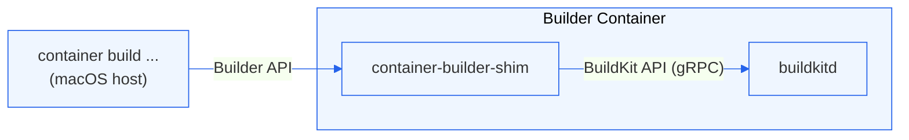

# container-builder-shim

**container-builder-shim** is a lightweight bridge that connects BuildKit's session protocol with containerization's Build API. It enables compatibility between BuildKit (the build engine behind Docker) and containerization by translating messages and file transfers between their respective APIs.

## What It Does

- **Protocol Translation:**
  - Translates session protocol messages from BuildKit into requests understood by containerization.

- **Session Management:**
  - Handles file synchronization, image resolution, build output streaming, and caching.

## Key Components

- **FSSync:** Transfers local files required for builds.
- **Resolver:** Resolves image references and tags.
- **ContentStore:** Retrieves and caches build dependencies like base images and layers.
- **Exporter:** Provides the final built image, including metadata and manifests.
- **IO Stream:** Streams real-time build logs and progress updates.

## How It Works



1. BuildKit initiates a session via gRPC.
2. container-builder-shim intercepts session requests (file sync, image resolution, etc.).
3. Requests are translated to containerization's Build API format and forwarded to the macOS host over a bidirectional gRPC stream.
4. The macOS host processes the request (serving context files, resolving images, etc.) and streams the response back.
5. Build output and metadata flow back through container-builder-shim to BuildKit.

## Build Attestations

The shim accepts gRPC-safe attestation metadata keys from the host and
forwards them into BuildKit's `SolveOpt.FrontendAttrs`:

- `attest-provenance` becomes `attest:provenance`
- `attest-sbom` becomes `attest:sbom`

Values are parsed with BuildKit's attestation parser before the solve starts,
so invalid CSV-style attestation parameters fail early. This keeps
`container build --provenance` and `container build --sbom` behavior aligned
with BuildKit while leaving attestation generation to BuildKit itself.

## Build Context Transfer

Build context files flow from the macOS host to BuildKit through a three-tier pipeline. Each tier has distinct responsibilities; understanding the split is important when working on file-transfer or security-related code.

### Responsibilities

| Tier | Responsibility |
|---|---|
| **macOS host** (`container` / `BuildFSSync`) | Owns the context directory. Enforces the context boundary: rejects any request that resolves outside the root. Packs requested files into a tar archive. Does **not** apply `.dockerignore`. |
| **container-builder-shim** (`pkg/fssync`) | Bridges the host's wire format and BuildKit's `filesync` gRPC interface. Receives the tar, unpacks it to a content-addressed local cache, applies `.dockerignore` exclusions, and presents the result to BuildKit via `DiffCopy`. |
| **BuildKit** | Owns all Dockerfile copy semantics: when to dereference symlinks, how to recurse directories, and how `.dockerignore` patterns are interpreted. Drives the transfer by sending `Walk` requests with `followpaths` and `exclude-patterns`. |

### Primary data flow

```
BuildKit ──► shim Walk (followpaths, exclude-patterns)
         ──► host: resolve globs, pack matching paths into tar
         ◄── tar stream
shim unpacks tar to content-addressed cache, applies .dockerignore
BuildKit ◄── DiffCopy PACKET_STAT   (one entry per file/dir/symlink)
BuildKit ──► PACKET_REQ             (for each regular file it needs)
BuildKit ◄── PACKET_DATA            (shim reads from local cache)
```

There is also a fallback path (`Info` → `Read`) used by `FS.Open` when the local cache is unpopulated — a narrow race window at the start of a build. The host enforces the same boundary rules on this path.

### Context boundary rules

These rules govern how files are selected, transferred, and presented. They reflect standard Docker build semantics and are enforced jointly by the host and the shim.

1. **Context boundary.** All files served to BuildKit must physically reside within the context root on the macOS host. Any request that resolves outside the root — whether by direct path or symlink chain — is rejected by the host.

2. **Out-of-context symlinks.** A symlink whose target lies outside the context root is present in the tar as a symlink entry, but its target is not included. BuildKit will fail to dereference it during `COPY`/`ADD` because the target is absent from the unpacked context. Symlinks in a build context should refer only to paths within the context root.

3. **In-context file symlink.** The host includes both the symlink entry and its target file in the tar. BuildKit dereferences the symlink during `COPY`/`ADD`; the result in the image is a regular file containing the target's content, not a symlink.

4. **In-context directory symlink.** The host follows the symlink and includes the directory's contents in the tar, applying rule 1 to every entry discovered through it. BuildKit recurses the directory during `COPY`/`ADD` as if it were a plain directory.

5. **Dangling symlink.** A symlink that is lexically within the context root but whose target cannot be resolved causes the target to be absent from the tar; BuildKit fails at `COPY`/`ADD` time.

### `.dockerignore`

`.dockerignore` filtering is the shim's responsibility, not the host's. After unpacking the tar, the shim walks the cache directory and applies the `exclude-patterns` received from BuildKit before emitting `PACKET_STAT` entries. The host has no knowledge of `.dockerignore`.

### `followpaths`

`followpaths` is a comma-separated list of glob patterns identifying which context paths BuildKit needs for the current build step. The shim forwards it to the host, which resolves the patterns against the context root to determine which files to pack into the tar.

If BuildKit does not supply `followpaths`, the shim falls back to `addedGlobs`: source paths pre-computed by scanning the Dockerfile AST for `COPY`, `ADD`, and `RUN --mount=type=bind` instructions (see `pkg/build/buildopts.go`).

## Contributing

Contributions to Containerization are welcomed and encouraged. Please see our [main contributing guide](https://github.com/apple/containerization/blob/main/CONTRIBUTING.md) for more information.
